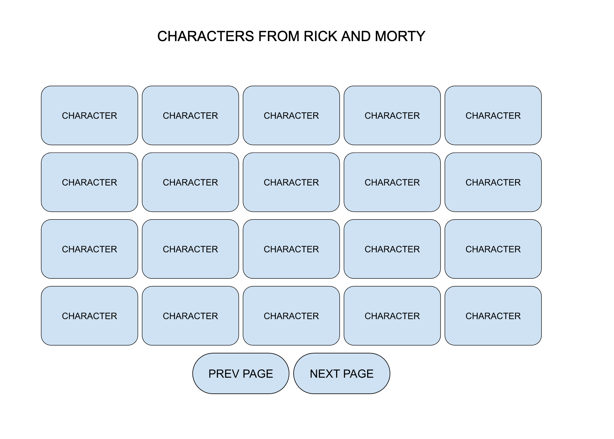
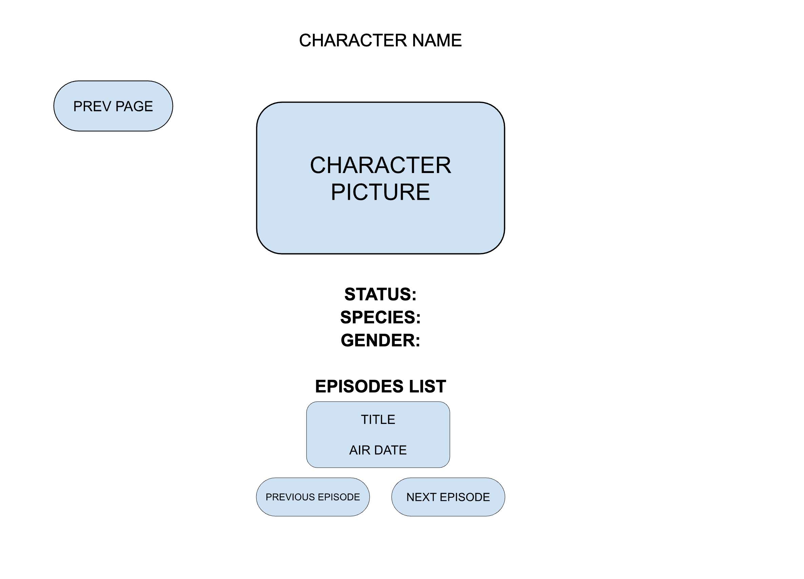

# Code Test

## Assignment

The application is setup with React Router containing two routes. The goal of
the assignment is to create these two pages based on the requirements. The assignment must be in a state where it is ready
from the assignee point of view to be pushed to production. What is written down is the bare minimum, but it could be improved
as the assignee would like to so its at his/her standard of production ready (as a hint, tests are a must in our company).

The data is fetched from
[Rick & Morty API](https://rickandmortyapi.com/documentation/#graphql)
with the already setup [urql](https://formidable.com/open-source/urql/) client.

The styling method is free of choice, it could be with css, scss, css-in-js or
other preferences.

- `/` - the home page
- `/character/:id` - the character page

### Home page

This page should list all the characters from the Rick & Morty API, paginated, displayed in batches of 20. Navigation has
to be implemented at least with some typical small arrows. Each person character must be linked to its own page.

As a general mockup, it should look like this:



### Person page

This page should contain an overview of the character

- Name
- Status
- Image
- Gender
- Origin

And then a separate section that will display the EPISODES where the character appeared,
sorted by air time, displaying the title and the air date, that allos the user to navigate through
them by clicking on arrows.

User must be able to get back to the previous page with a GO BACK button as well. As a mockup 
you can get inspired by this image:



## Setup

Install dependencies (using NPM)

```bash
$ npm install
```

Download GraphQL Schema

```bash
$ npm run download-schema
```

Generate GraphQL Types (generated types will be in `src/generated/graphql.ts`

```bash
$ npm run codegen
```

Start dev mode

```bash
$ npm run dev
```
